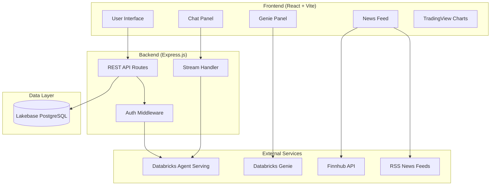
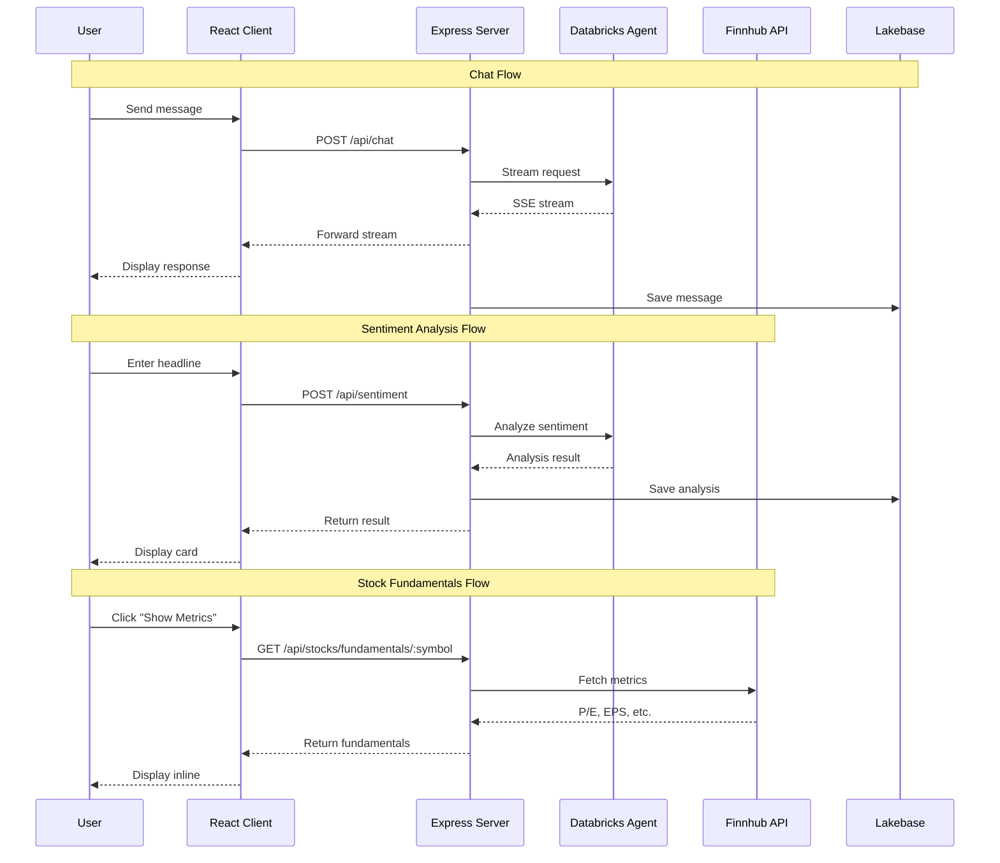

# Equity Analyst App

<p align="center">
  <strong>AI-Powered Stock Research & Market Intelligence Platform</strong>
</p>

<p align="center">
  Built on Databricks | Real-time Sentiment Analysis | Live Market Data
</p>

<p align="center">
  <a href="#features"><strong>Features</strong></a> ·
  <a href="#architecture"><strong>Architecture</strong></a> ·
  <a href="#getting-started"><strong>Getting Started</strong></a> ·
  <a href="#deployment"><strong>Deployment</strong></a> ·
  <a href="#codebase-guide"><strong>Codebase Guide</strong></a>
</p>

---

## Overview

The Equity Analyst App is a full-stack application that provides AI-powered equity research capabilities. It combines real-time news sentiment analysis, market data, and conversational AI to help users make informed investment decisions.

## Features

- **News Sentiment Analysis**: AI-powered analysis of financial news headlines with bullish/bearish/neutral classification
- **Real-time Market Indices**: Live tracking of S&P 500, NASDAQ, DOW, and VIX
- **Stock Fundamentals On-Demand**: P/E ratio, EPS, market cap, revenue, and earnings data
- **Resizable Panels**: Customizable workspace with draggable Chat and Genie panels
- **Conversational AI**: Chat interface powered by Databricks Agent Serving
- **Genie Analytics**: Natural language queries for equity research intelligence
- **Sector Impact Analysis**: Aggregated sentiment across market sectors
- **TradingView Integration**: Interactive stock charts
- **Persistent Chat History**: Optional database-backed conversation storage

---

## Architecture

### High-Level System Architecture



### Request Flow Architecture



### Component Architecture

```mermaid
flowchart LR
    subgraph Frontend
        App[App.tsx]
        App --> Chat[chat.tsx]
        Chat --> CP[ChatPanel]
        Chat --> GP[GeniePanel]
        Chat --> NF[NewsFeed]

        CP --> Msg[Messages]
        CP --> Input[MultimodalInput]

        NF --> NC[NewsCard]
        NF --> SD[SentimentDashboard]
        NF --> MI[MarketIndices]

        NC --> Fund[Fundamentals Display]
    end

    subgraph Backend
        Index[index.ts]
        Index --> ChatR[/api/chat]
        Index --> SentR[/api/sentiment]
        Index --> StockR[/api/stocks]
        Index --> GenieR[/api/genie]
        Index --> NewsR[/api/news]
    end

    subgraph Packages
        Core[core]
        AuthPkg[auth]
        DB[db]
        AIProviders[ai-sdk-providers]
    end

    Frontend --> Backend
    Backend --> Packages
```

---

## Project Structure

```
equity-analyst-app/
├── client/                          # React Frontend
│   ├── src/
│   │   ├── components/
│   │   │   ├── chat-panel.tsx       # Resizable chat panel
│   │   │   ├── genie-panel.tsx      # Resizable Genie panel
│   │   │   ├── news-feed.tsx        # Main news analysis view
│   │   │   ├── market-indices.tsx   # S&P, NASDAQ, DOW, VIX display
│   │   │   ├── sentiment-dashboard.tsx
│   │   │   └── ui/                  # Reusable UI components
│   │   ├── contexts/
│   │   │   └── ActiveTabContext.tsx # Panel state & widths
│   │   ├── hooks/                   # Custom React hooks
│   │   └── lib/                     # Utilities
│   └── vite.config.ts
│
├── server/                          # Express Backend
│   ├── src/
│   │   ├── routes/
│   │   │   ├── chat.ts              # Chat streaming endpoint
│   │   │   ├── sentiment.ts         # News analysis endpoint
│   │   │   ├── stocks.ts            # Quotes & fundamentals
│   │   │   ├── genie.ts             # Genie analytics
│   │   │   └── news.ts              # RSS feed proxy
│   │   ├── middleware/
│   │   │   └── auth.ts              # Databricks authentication
│   │   └── index.ts                 # Server entry point
│
├── packages/                        # Shared Libraries
│   ├── core/                        # Types, errors, schemas
│   ├── auth/                        # Databricks auth utilities
│   ├── db/                          # Drizzle ORM & migrations
│   ├── ai-sdk-providers/            # Databricks AI SDK integration
│   └── utils/                       # Shared utilities
│
├── scripts/                         # Automation Scripts
│   ├── quickstart.sh                # Interactive setup wizard
│   ├── start-app.sh                 # Local dev server
│   └── cleanup-database.sh          # DB instance management
│
├── databricks.yml                   # Databricks Asset Bundle config
├── app.yaml                         # Databricks App runtime config
└── drizzle.config.ts               # Database ORM config
```

---

## Getting Started

### Prerequisites

1. **Node.js 20+** - Required runtime
2. **Databricks CLI** - For authentication and deployment
3. **Databricks Workspace** - With Agent Serving endpoint access
4. **Finnhub API Key** (Optional) - For live stock quotes

### Quick Start

```bash
# 1. Clone the repository
git clone https://github.com/AnanyaDBJ/equity-analyst-app-agent.git
cd equity-analyst-app-agent

# 2. Run the interactive setup wizard
./scripts/quickstart.sh

# 3. Start the development server
./scripts/start-app.sh
```

The quickstart script will:
- Install all prerequisites (Node.js, Databricks CLI)
- Configure Databricks authentication
- Set up your serving endpoint
- Optionally provision a Lakebase database
- Create your `.env.local` configuration

### Manual Setup

```bash
# 1. Install dependencies
npm install

# 2. Copy environment template
cp .env.example .env.local

# 3. Configure .env.local with your values:
#    - DATABRICKS_CONFIG_PROFILE
#    - DATABRICKS_SERVING_ENDPOINT
#    - FINNHUB_API_KEY (optional)
#    - Database settings (optional)

# 4. Authenticate with Databricks
databricks auth login --profile your-profile-name

# 5. Start development server
npm run dev
```

The app will be available at:
- Frontend: http://localhost:3000
- Backend: http://localhost:3001

---

## Deployment

### Deploy to Databricks Apps

```bash
# 1. Validate bundle configuration
databricks bundle validate

# 2. Deploy resources
databricks bundle deploy

# 3. Start the application
databricks bundle run databricks_chatbot

# 4. View deployment status
databricks bundle summary
```

### Deployment Targets

| Target | Description | Command |
|--------|-------------|---------|
| dev | Development (default) | `databricks bundle deploy` |
| staging | Staging environment | `databricks bundle deploy -t staging` |
| prod | Production | `databricks bundle deploy -t prod` |

### Enable Database (Persistent Chat History)

To enable persistent storage, uncomment both database sections in `databricks.yml`:

1. **Database Instance** (~line 18):
```yaml
resources:
  database_instances:
    chatbot_lakebase:
      name: ${var.database_instance_name}-${var.resource_name_suffix}
      capacity: CU_1
```

2. **Database Resource Binding** (~line 41):
```yaml
- name: database
  database:
    database_name: databricks_postgres
    instance_name: ${resources.database_instances.chatbot_lakebase.name}
    permission: CAN_CONNECT_AND_CREATE
```

---

## Codebase Guide

### Key Workflows

#### 1. News Sentiment Analysis

```
User enters headline → POST /api/sentiment → Databricks Agent analyzes
→ Returns: company, sentiment (bullish/bearish/neutral), confidence, rationale
→ Saved to database → Displayed as NewsCard
```

**Key Files:**
- `client/src/components/news-feed.tsx` - UI and state management
- `server/src/routes/sentiment.ts` - API endpoint
- `packages/db/src/queries.ts` - Database operations

#### 2. Chat Streaming

```
User sends message → POST /api/chat → Vercel AI SDK streams response
→ Server-Sent Events (SSE) → Real-time display → Save to database
```

**Key Files:**
- `client/src/components/chat-panel.tsx` - Chat UI
- `server/src/routes/chat.ts` - Streaming endpoint
- `packages/ai-sdk-providers/` - Databricks provider

#### 3. Stock Fundamentals (On-Demand)

```
User clicks "Show Metrics" → GET /api/stocks/fundamentals/:symbol
→ Finnhub API (cached 5 min) → Display P/E, EPS, Market Cap, etc.
```

**Key Files:**
- `client/src/components/news-feed.tsx` - NewsCard with metrics button
- `server/src/routes/stocks.ts` - Fundamentals endpoint

### Adding New Features

#### Add a New API Endpoint

```typescript
// server/src/routes/my-feature.ts
import { Router } from 'express';
import { authMiddleware } from '../middleware/auth';

export const myFeatureRouter = Router();
myFeatureRouter.use(authMiddleware);

myFeatureRouter.get('/endpoint', async (req, res) => {
  // Implementation
  res.json({ data: 'result' });
});

// Register in server/src/index.ts
app.use('/api/my-feature', myFeatureRouter);
```

#### Add a New Database Table

```typescript
// 1. Add to packages/db/src/schema.ts
export const myTable = aiChatbotSchema.table('my_table', {
  id: uuid('id').primaryKey().defaultRandom(),
  name: varchar('name', { length: 256 }),
  createdAt: timestamp('created_at').defaultNow(),
});

// 2. Generate migration
npm run db:generate

// 3. Apply migration
npm run db:migrate
```

#### Add a New React Component

```tsx
// client/src/components/my-component.tsx
import { useState } from 'react';
import { Button } from '@/components/ui/button';

export function MyComponent() {
  const [data, setData] = useState(null);

  return (
    <div className="p-4">
      {/* Component content */}
    </div>
  );
}
```

### State Management

| Context | Purpose | Location |
|---------|---------|----------|
| `ActiveTabContext` | Panel open/close state, panel widths | `contexts/ActiveTabContext.tsx` |
| `SessionContext` | User authentication state | `contexts/SessionContext.tsx` |
| `AppConfigContext` | App configuration (chat history enabled, etc.) | `contexts/AppConfigContext.tsx` |

### Database Operations

```bash
npm run db:generate   # Generate migrations from schema changes
npm run db:migrate    # Apply pending migrations (production-safe)
npm run db:studio     # Open visual database editor
npm run db:reset      # Reset database (DESTRUCTIVE)
```

---

## Environment Variables

| Variable | Required | Description |
|----------|----------|-------------|
| `DATABRICKS_CONFIG_PROFILE` | Yes | Databricks CLI profile name |
| `DATABRICKS_SERVING_ENDPOINT` | Yes | Agent serving endpoint name |
| `FINNHUB_API_KEY` | No | For live stock quotes |
| `PGHOST` | No* | Lakebase database host |
| `PGUSER` | No* | Database username |
| `PGDATABASE` | No* | Database name (default: databricks_postgres) |

*Required for persistent chat history

---

## Testing

```bash
# Run all tests
npm test

# Run with UI
npx playwright test --ui

# Run specific test file
npx playwright test tests/e2e/chat.test.ts
```

---

## Common Commands

| Command | Description |
|---------|-------------|
| `npm run dev` | Start dev server (frontend + backend) |
| `npm run build` | Build for production |
| `npm run lint` | Lint and fix code (Biome) |
| `npm test` | Run Playwright tests |
| `databricks bundle deploy` | Deploy to Databricks |
| `databricks bundle run databricks_chatbot` | Start deployed app |

---

## Troubleshooting

### "Checking endpoint availability..." stuck
- Verify `DATABRICKS_SERVING_ENDPOINT` is set correctly
- Check Databricks authentication: `databricks auth describe`

### Stock quotes not loading
- Ensure `FINNHUB_API_KEY` is set in `.env.local`
- Free tier: 60 API calls/minute limit

### Database connection errors
- Run `./scripts/get-pghost.sh` to get correct PGHOST
- Verify database is provisioned: `databricks bundle summary`

### "Resource not found" during deploy
- Bundle state mismatch - run: `databricks bundle unbind <resource-name>`

---

## License

This project is for demonstration and educational purposes.

---

<p align="center">
  Built with Databricks | Powered by AI
</p>
